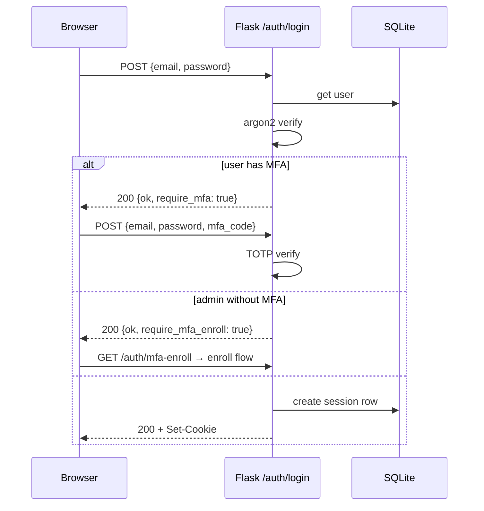

# API HTTP — snapshot-V3

Todas las rutas son relativas al backend Flask (default `http://127.0.0.1:5070`).
Excepto `/api/heartbeat` (M2M Bearer), todas requieren sesión web válida.

## Convenciones

- Sesión: cookie `snapshot_session` (HttpOnly, **SameSite=Lax**, Secure en HTTPS, `max_age` = `SESSION_TTL_HOURS * 3600` segundos = 8h por default). Idle timeout 8h (`IDLE_TIMEOUT_MINUTES=480`), refresca en cada request.
- CSRF: header `X-CSRF-Token` en `POST/PUT/PATCH/DELETE` (token expuesto en `<meta name="csrf-token">`).
- Respuestas JSON: `{"ok": bool, "data": <obj|null>, "error": <str|null>}` para `/api/*`,
  o `{"ok": bool, ...}` con campos directos en `/auth/*`.
- Errores estándar:
  - 401 `unauthenticated` — sin sesión válida
  - 403 `forbidden` o `csrf` — sesión OK pero faltó permiso o CSRF
  - 400 `<msg>` — payload inválido o regla de validación
  - 404 — recurso no existe (o blueprint no cargado en este modo)

## Auth — `/auth/*`

Blueprint que **siempre** se registra (cliente y central).

| Método | Path | Quién | Para qué |
|---|---|---|---|
| `GET`  | `/auth/login` | público | Renderiza `login.html` |
| `POST` | `/auth/login` | público | Body `{email, password, mfa_code?}`. Devuelve `{ok, require_mfa?, require_mfa_enroll?}` |
| `POST` | `/auth/logout` | logueado | Revoca la sesión actual |
| `GET`  | `/auth/csrf` | logueado | Devuelve `{csrf_token}` para clientes JSON |
| `GET`  | `/auth/me` | logueado | Devuelve `{id, email, role, display_name, mfa_enrolled, mfa_disabled}` |
| `POST` | `/auth/password` | logueado | Body `{current, new}`. Cambia password, revoca otras sesiones |
| `POST` | `/auth/mfa/enroll/start` | logueado sin MFA | Devuelve TOTP secret + URI para QR |
| `POST` | `/auth/mfa/enroll/confirm` | logueado sin MFA | Body `{code}`. Persiste el secret y devuelve backup codes |
| `POST` | `/auth/reset-request` | público | Body `{email}`. Genera token de reset y envía email (si SMTP configurado) |
| `POST` | `/auth/reset-consume` | público | Body `{token, new_password}`. Aplica reset |
| `GET`  | `/auth/users` | admin | Lista usuarios. Cada uno trae `{id, email, display_name, role, status, mfa_enrolled, mfa_disabled, last_login_at}` |
| `POST` | `/auth/users` | admin | Crea usuario. Body `{email, display_name, role, password?}` |
| `POST` | `/auth/users/<uid>` | admin | **Editar perfil/rol/MFA en una sola llamada.** Body acepta cualquier subset de `{display_name?, email?, role?, mfa_disabled?}`. Guards: no puedes cambiar tu propio rol ni desactivar tu propio MFA. |
| `POST` | `/auth/users/<uid>/set-role` | admin | Body `{role}`. Equivalente a `POST /auth/users/<uid>` con solo `role`. Mismo guard de self-edit. |
| `POST` | `/auth/users/<uid>/disable` | admin | |
| `POST` | `/auth/users/<uid>/enable` | admin | |
| `POST` | `/auth/users/<uid>/reset-password` | admin | Devuelve `{temp_password}` |
| `POST` | `/auth/users/<uid>/revoke-sessions` | admin | Cierra todas las sesiones del user |
| `POST` | `/auth/users/<uid>/reset-mfa` | admin | Borra el secret MFA y los backup codes. Si el usuario tiene `mfa_disabled=true`, el flag se preserva y el siguiente login no pide nada. |

### Flag `mfa_disabled` (per-usuario)

Cuando está en `true`, el login para ese usuario **salta enroll y challenge TOTP**, aunque su rol sea `admin`. El secret MFA existente NO se borra (puedes reactivar desmarcando el flag). Se setea desde `POST /auth/users/<uid>` con body `{mfa_disabled: true}` o desde la UI en `/users → Editar`.

### Login flow



## Snapshot panel — `/api/*`

Blueprint principal (siempre). Todos requieren login excepto `/api/health`.

### Sistema

| Método | Path | Roles | Notas |
|---|---|---|---|
| `GET` | `/api/health` | público | `{status: "up"}` |
| `GET` | `/api/logs?lines=N` | admin/operator | Tail de `/var/log/snapshot-v3/snapctl.log` (máx 5000) |
| `GET` | `/api/jobs?limit=N` | logueado | Lista de ejecuciones recientes del CLI |
| `GET` | `/api/jobs/<jid>` | logueado | Detalle del job (stdout, stderr, rc) |

### Configuración

| Método | Path | Roles | Para qué |
|---|---|---|---|
| `GET`  | `/api/config` | admin/operator | `{backup_paths: [...], excludes: [...]}` |
| `POST` | `/api/config` | admin | Setea paths a backup |
| `GET`  | `/api/archive/config` | logueado | Taxonomía + flag de password |
| `POST` | `/api/archive/config` | admin | Setea proyecto/entorno/pais/nombre/keep_months |
| `POST` | `/api/archive/password` | admin | Setea ARCHIVE_PASSWORD |
| `DELETE` | `/api/archive/password` | admin | Quita encriptación openssl |
| `GET`  | `/api/db-archive/config` | admin | Targets DB + creds (passwords no se devuelven) |
| `POST` | `/api/db-archive/config` | admin | Body con engine targets, hosts, users, passwords |
| `GET`  | `/api/crypto/config` | admin | `{recipients, recipients_count, active_mode}` |
| `POST` | `/api/crypto/config` | admin | Body `{recipients}` (space-separated `age1...`) |
| `POST` | `/api/crypto/keygen` | admin | Genera keypair age. Retorna `{public, private}` UNA VEZ |

### Drive (rclone)

| Método | Path | Roles | Para qué |
|---|---|---|---|
| `GET`  | `/api/drive/status` | logueado | Estado de la vinculación + remote actual |
| `POST` | `/api/drive/link` | admin | Body `{token: "..."}` con el JSON producido por `rclone authorize "drive"`. **Es el flujo primary** — la UI tanto en `/central/drive` como en cliente `/settings` usa esto. |
| `POST` | `/api/drive/unlink` | admin | Borra rclone.conf |
| `GET`  | `/api/drive/shared` | admin | Lista shared drives accesibles |
| `POST` | `/api/drive/target` | admin | Body `{kind: "shared"\|"personal", shared_id?}` |
| `POST` | `/api/drive/oauth/device/start` | admin | (legacy) Inicia Device Flow. **Limitación**: Google rechaza el scope `drive` (full) vía Device Flow, solo acepta `drive.file`. Para scope completo usar `/api/drive/link` con `rclone authorize`. |
| `POST` | `/api/drive/oauth/device/poll` | admin | (legacy) Polling del Device Flow |

### DB backups (sub-E)

| Método | Path | Roles | Para qué |
|---|---|---|---|
| `GET`  | `/api/db-archive/config` | admin | Targets DB + creds (passwords no se devuelven, solo `*_password_set: bool`) |
| `POST` | `/api/db-archive/config` | admin | Body con engine targets, hosts, users, passwords |
| `GET`  | `/api/db-archive/summary` | logueado | `{configured_engines, last_per_engine, last_overall_ts, total_dumps, total_size_bytes}` — alimenta el KPI "Último backup BD" del Dashboard |
| `POST` | `/api/db-archive/create` | admin/operator | Body `{engines?: [...], targets?: [...]}`. Sin filtros corre todos los configurados. Síncrono — hasta `SNAPCTL_TIMEOUT`. Devuelve `{ok_count, fail_count, duration_s}` |
| `POST` | `/api/db-archive/check-connection` | admin | Body `{engine, password?}`. Si `password` se pasa, valida con esa sin guardarla — útil para "probar antes de guardar". Devuelve `{ok, engine, latency_ms?, error?}` |

### Cliente → Central (vinculación)

Solo activo en `MODE=client`. Permite al admin del cliente configurar la URL+token del central desde la UI, sin tener que editar `local.conf` a mano.

| Método | Path | Roles | Para qué |
|---|---|---|---|
| `GET`  | `/api/client/central-link` | admin | `{central_url, token_set: bool, configured: bool}`. **Nunca devuelve el token plaintext.** |
| `POST` | `/api/client/central-link` | admin | Body `{central_url?, central_token?, clear_token?, clear_url?}`. Persiste a `local.conf` y refleja en `Config.*` en memoria sin restart. |
| `POST` | `/api/client/central-link/test` | admin | Prueba la vinculación: `GET /api/v1/ping` (URL alcanzable) + `GET /api/v1/auth-check` (token válido). Body opcional `{central_url?, central_token?}` para probar sin guardar. Devuelve `{ok, url_ok, token_ok, central_version?, client_proyecto?, error?}` |

### Archive operations

| Método | Path | Roles | Para qué |
|---|---|---|---|
| `GET`  | `/api/archive/list?force=0\|1` | admin/operator | Lista archives en Drive |
| `GET`  | `/api/archive/summary?force=0\|1` | logueado | KPIs: count, last, size total |
| `POST` | `/api/archive/create` | admin/operator | Dispara archive ahora (sync, hasta `SNAPCTL_TIMEOUT`) |
| `POST` | `/api/archive/restore` | admin | Body `{path, target_dir}` |
| `POST` | `/api/archive/delete` | admin | Body `{path}` |

## Audit — `/audit/*`

Solo si `SNAPSHOT_AUDIT_VIEWER=1` en local.conf. Requiere login con rol `admin` o `auditor`.

La auditoría se materializa en DB (`drive_inventory` + `drive_inventory_files` + `drive_scans`); la UI nunca toca rclone en cambios de vista. Solo `POST /audit/api/refresh` (botón "Refrescar") gatilla un scan real de Drive y reescribe esas tablas atómicamente. Los heartbeats que llegan con campo `inventory` también actualizan el subárbol del cliente que reportó.

| Método | Path | Para qué |
|---|---|---|
| `GET`  | `/audit/` | Vista agregada de clientes (HTML) |
| `GET`  | `/audit/api/status?force=1` | JSON con KPIs + clientes + `last_scan` (metadata del último scan ok) |
| `GET`  | `/audit/api/tree?force=0\|1` | Árbol jerárquico proyecto → región → cliente → backup. `force=1` gatilla scan rclone + reescribe DB |
| `GET`  | `/audit/api/local?force=0\|1` | Vista filtrada al cliente local (solo `MODE=client`) |
| `POST` | `/audit/api/refresh` | **Gatilla scan completo de Drive** (síncrono). Devuelve `{scan: {scan_id, files_total, size_bytes_total, leaves_total, duration_s, ...}}` |

## Central — solo si `MODE=central`

### M2M (Bearer token) — `/api/v1/*`

| Método | Path | Auth | Para qué |
|---|---|---|---|
| `GET`  | `/api/v1/ping` | público | Health del receptor: `{ok, version}` |
| `GET`  | `/api/v1/auth-check` | Bearer | Valida el token sin crear ningún `central_event`. Devuelve `{ok, client: {id, proyecto}, token: {label, scope}}`. Lo usa el cliente desde `/settings → Probar conexión`. |
| `POST` | `/api/v1/heartbeat` | Bearer | Recibe heartbeat del cliente. Idempotente por `event_id`. |

#### Heartbeat schema (`POST /api/heartbeat`)

```json
{
  "event_id": "550e8400-e29b-41d4-a716-446655440000",
  "ts": "2026-04-28T12:34:56Z",
  "client": {
    "proyecto": "superaccess-uno",
    "entorno": "cloud",
    "pais": "colombia"
  },
  "target": {
    "category": "os",       // os | db
    "subkey": "linux",      // linux | postgres | mysql | mongo
    "label": "host01"       // hostname o dbname
  },
  "operation": {
    "op": "archive",        // archive | create | reconcile | prune | delete | db_dump
    "status": "ok",         // ok | fail | running
    "started_at": "2026-04-28T12:30:00Z",
    "duration_s": 296,
    "error": null
  },
  "snapshot": {
    "size_bytes": 1572864000,
    "remote_path": "superaccess-uno/cloud/colombia/os/linux/host01/2026/04/28/servidor_host01_20260428_123000.tar.zst.age"
  },
  "totals": {
    "size_bytes": 18800000000,
    "count_files": 24
  },
  "host_meta": {
    "hostname": "host01",
    "snapctl_version": "v3.x",
    "rclone_version": "v1.68.2",
    "missing_paths": []
  },
  "inventory": {
    "scanned_at": "2026-04-28T12:34:56Z",
    "leaves": [
      {"category": "os", "subkey": "linux", "files": [
        {"name": "...", "path": "...", "size": 12345, "ts": "20260428_063012", "encrypted": true, "crypto": "age"}
      ]}
    ]
  }
}
```

- `event_id` debe ser UUID v4. Idempotencia: el central rechaza con 200 (no error) si ya recibió ese event_id.
- Tope hard de payload: 64 KiB (`CENTRAL_MAX_PAYLOAD_BYTES`).
- Headers obligatorios: `Authorization: Bearer <token>`, `Content-Type: application/json`.
- **`inventory` es opcional** (sub-E follow-up). Si está presente, central upserts en `drive_inventory` el subárbol de ese cliente — mantiene el cache vivo entre refrescos manuales. Caps: 64 leaves, 200 files total. Cliente lo activa con `CENTRAL_PUSH_INVENTORY=1` en `local.conf` (default off).

### Admin de clientes — `/api/admin/*`

Todos requieren login con permiso correspondiente (ver matriz en `base_datos_y_roles.md`).

| Método | Path | Permiso |
|---|---|---|
| `GET` | `/api/admin/clients` | `central.clients:read` |
| `POST` | `/api/admin/clients` | `central.clients:write` |
| `GET` | `/api/admin/clients/<cid>` | `central.clients:read` |
| `PATCH` | `/api/admin/clients/<cid>` | `central.clients:write` |
| `DELETE` | `/api/admin/clients/<cid>` | `central.clients:write` |
| `POST` | `/api/admin/clients/<cid>/tokens` | `central.tokens:issue` |
| `DELETE` | `/api/admin/tokens/<tid>` | `central.tokens:revoke` |
| `GET` | `/api/admin/tokens` | `central.tokens:revoke` |
| `GET` | `/api/admin/events` | `central.dashboard:view` |

### Alertas — `/api/admin/alerts/*`

| Método | Path | Permiso |
|---|---|---|
| `GET` | `/api/admin/alerts?active=1` | `central.dashboard:view` |
| `GET` | `/api/admin/alerts/config` | `central.dashboard:view` |
| `POST` | `/api/admin/alerts/config` | `central.alerts:configure` |
| `GET` | `/api/admin/alerts/<id>` | `central.dashboard:view` |
| `POST` | `/api/admin/alerts/<id>/acknowledge` | `central.alerts:configure` |

### Vistas HTML

| Path | Permiso |
|---|---|
| `/dashboard-central` | `central.dashboard:view` |
| `/dashboard-central/clients` | `central.clients:read` |
| `/dashboard-central/clients/<cid>` | `central.clients:read` |
| `/dashboard-central/clients/<cid>/tokens` | `central.tokens:revoke` |
| `/dashboard-central/alerts` | `central.dashboard:view` |

## Web (HTML) — `/`

| Path | Auth | Para qué |
|---|---|---|
| `/` | logueado | Dashboard cliente (KPIs + último archive) |
| `/snapshots` | logueado | Listado de archives en Drive |
| `/logs` | admin/operator | Tail JSON-lines del log |
| `/settings` | admin | Drive + taxonomía + DB + crypto + alertas (central) |
| `/users` | admin | Gestión de cuentas |
| `/auth/login` | público | |
| `/auth/mfa-enroll` | público (post-login parcial) | |
| `/auth/reset-request` | público | |
| `/auth/reset?token=…` | público | |
| `/auth/change-password` | logueado | |

## Códigos de estado del CLI (`snapctl ... ; echo $?`)

| Code | Significado |
|---|---|
| 0 | OK |
| 1 | Error genérico |
| 2 | Error de validación / argumento inválido |
| 130 | Interrumpido (SIGINT) |
| Otro | Propaga rc del subproceso (rclone, restic, age, ...) |
