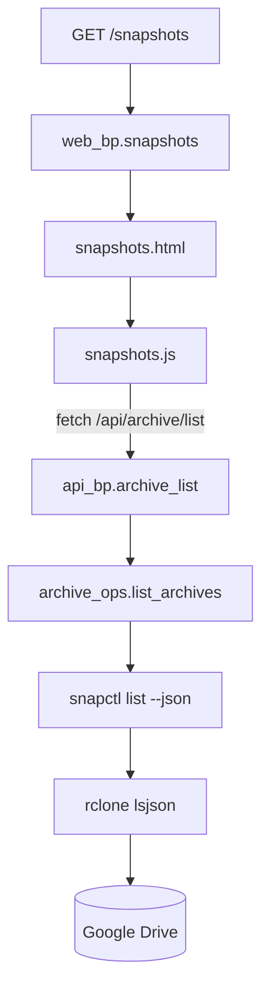
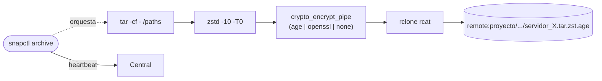
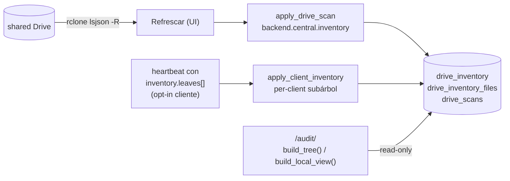

# Arquitectura y stack — snapshot-V3

## Stack en una línea

`Bash 5+ (CLI) + Flask 3 (panel) + SQLite WAL (state) + rclone (storage) + age/openssl (crypto) + systemd (orquestación)`

## Componentes

```mermaid
flowchart LR
    subgraph Host["Host del cliente (Ubuntu 22.04+)"]
        direction TB
        snapctl["snapctl<br/>(bash CLI)"]
        timer["systemd timers<br/>archive · db-archive · reconcile"]
        backend["snapshot-backend<br/>(gunicorn + Flask)"]
        sqlite[("SQLite<br/>/var/lib/snapshot-v3/snapshot.db")]
        venv["Python 3.12<br/>(.venv bundled)"]
        bundle["bundle/bin<br/>rclone · restic · age · zstd"]
    end

    timer -->|invoca| snapctl
    snapctl -->|tar/dump &#124; zstd &#124; crypto &#124; rcat| GDrive[(Google Drive<br/>shared)]
    snapctl -->|heartbeat POST| Central
    backend -->|exec| snapctl
    backend --- sqlite
    backend --- venv
    snapctl --- bundle

    User((Operador)) -->|HTTPS :5070| backend
    Central[["Instalación central<br/>(MODE=central)"]] --- AlertChan[Email · Webhook]
```



### En el cliente

| Componente | Lenguaje | Para qué |
|---|---|---|
| `core/bin/snapctl` | Bash | CLI principal: `archive`, `restore`, `db-archive`, `central`, `admin`, ... |
| `core/lib/*.sh` | Bash | Bibliotecas: `archive.sh`, `db_archive.sh`, `crypto.sh`, `central.sh`, `drive.sh`, `common.sh` |
| `backend/app.py` | Python (Flask) | Panel web, sirve la API REST y el HTML |
| `backend/auth/` | Python | Autenticación, sesiones, MFA, RBAC, audit |
| `backend/services/` | Python | Wrappers de `snapctl`, lectura/escritura de `local.conf`, OAuth Drive |
| `backend/routes/` | Python | Blueprints HTTP: `api`, `audit`, `web` |
| `backend/central/` | Python | Blueprints solo activos en `MODE=central` |
| `frontend/templates/` | Jinja2 | HTML server-rendered (sin SPA) |
| `frontend/static/` | JS + CSS | Tailwind via CDN + variables CSS shadcn-like |
| `bundle/bin/` | binarios | rclone, restic, age, zstd con versión pinneada |

### En la instalación central

Mismo binario, mismos archivos. Solo cambia:

- `MODE=central` en `snapshot.local.conf`
- Se registran 4 blueprints adicionales: `central_api_bp`, `central_admin_bp`, `central_dashboard_bp`, `central_alerts_bp`
- El CLI registra el comando `snapctl central` (bootstrap, drain-queue, alerts-sweep)

## Capas (referidas a una request HTTP del panel)



## Capas (motor de archive)



## Modelo de proceso

```mermaid
flowchart TB
    subgraph systemd
      U1[snapshot-backend.service<br/>gunicorn 2 workers]
      T1[snapshot@archive.timer<br/>monthly]
      T2[snapshot@db-archive.timer<br/>daily]
      T3[snapshot@reconcile.timer<br/>weekly]
      T4[snapshot-healthcheck.service<br/>every 15m]
    end
    T1 --> O1[snapshot@archive.service<br/>oneshot snapctl archive]
    T2 --> O2[snapshot@db-archive.service<br/>oneshot snapctl db-archive]
    T3 --> O3[snapshot@reconcile.service<br/>oneshot snapctl reconcile]
    T4 --> O4[ExecStartPost: drain-queue<br/>+ alerts-sweep]
    O1 -->|writes audit/jobs| DB[(SQLite)]
    U1 --- DB
```

- El backend Flask **no** ejecuta `snapctl` en background; cuando el
  user dispara una operación desde la UI, gunicorn la ejecuta sincrónica
  con `subprocess.run` y un timeout (default 1h, configurable con
  `SNAPCTL_TIMEOUT`). Mientras corre, el endpoint POST está bloqueado;
  el frontend muestra un overlay de "Trabajando…".
- Los timers de systemd corren independientes del backend. Pueden
  funcionar aún si el backend está caído. La UI solo lee estado de
  ellos.

## Capa de auditoría (sub-E v2)



- **Drive sigue siendo fuente de verdad.** Las tablas son cache reescrita atómicamente por el botón "Refrescar".
- **Lectura sub-segundo:** cambiar de vista en `/audit/` no toca rclone — solo lee de DB.
- **Heartbeats con `inventory`** (opt-in con `CENTRAL_PUSH_INVENTORY=1` en cliente) mantienen el cache vivo entre refrescos.
- **Filename regex flexible**: ancla en timestamp `YYYYMMDD_HHMMSS`. Acepta cualquier prefix (`servidor_`, `postgresql_`, `mysql_`, `mongo_`, ...) y cualquier extensión (`.7z`, `.tar.zst`, `.age`, `.enc`).

## Conexión SQLite con threads

`auth_conn` es un wrapper `ThreadLocalConn` definido en `backend/app.py`: cada thread de gunicorn obtiene su propia `sqlite3.Connection`, todas apuntando al mismo `.db`. SQLite WAL maneja la concurrencia entre conexiones distintas (lectores múltiples + 1 escritor con `busy_timeout=10s`). El patrón viejo de **una sola conexión compartida** rompía con `InterfaceError` cuando múltiples XHRs en paralelo (notable `/settings`) pisaban el state interno del cursor.

## Decisiones puntuales (con su porqué)

### Por qué Flask y no FastAPI/Django

- Flask es trivial de operar (`gunicorn app:app`) y empacar (`pip install` sobre venv).
- Sin async, evitamos el boilerplate.
- Hay menos de 50 endpoints — el routing manual de Flask alcanza sobrado.

### Por qué SQLite con WAL

- Single-host deploy, single-process write (`gunicorn` workers son lectores; el writer real es el `before_request` de auth y ocasionalmente las llamadas POST).
- WAL evita el clásico "database is locked" de SQLite default.
- Sin admin de DB, sin DBA, sin parches de seguridad de Postgres.
- Backup del DB = `cp` (durante WAL es seguro con `pragma wal_checkpoint(FULL)`).

### Por qué `tar | zstd` y no restic

- Para archives mensuales cold-storage, `tar.zst` es:
  - Restaurable con cualquier sistema (`zstd -dc | tar -x`), no requiere restic.
  - Streamable directo a `rclone rcat` sin pasar por disco.
  - Menos espacio que restic `prune` retroactivo.
- Restic queda como motor incremental local (separado, no usa `archive`).

### Por qué age en vez de openssl PBKDF2

- Public-key crypto: la privada no vive en el servidor.
- Compromiso del host ≠ compromiso de los backups.
- Multiple recipients (operacional + escrow) trivial.
- openssl PBKDF2 sigue disponible (`ARCHIVE_PASSWORD`) para usuarios que prefieren password compartida.

### Por qué heartbeats Bearer y no mTLS

- mTLS requiere CA propia o ACME interno, complicado de operar.
- Bearer token + HTTPS = simple, suficiente para este threat model
  (telemetría sin contenido sensible, no movimiento de archivos).
- Cada cliente tiene su propio token revocable independiente.

### Por qué un único `snapctl install.sh` en bash

- No requiere Python instalado para arrancar (lo trae bundled).
- Idempotente, re-ejecutable sobre upgrades.
- Hace `rsync --delete` de `/opt/snapshot-V3` y respeta `/etc/snapshot-v3` (que vive aparte).

## Versiones pinneadas (relevantes)

- Python: **3.12.8** (bundled en `.venv`)
- Flask 3.x, Flask-Limiter, Flask-Talisman
- argon2-cffi, pyotp, cryptography (HKDF, AES-GCM)
- rclone: **v1.68.2**
- restic: **0.17.3**
- age: **v1.2.1**
- zstd: del sistema (`apt install zstd`, mínimo 1.5)

## Referencias

- Detalle de tablas: [base_datos_y_roles.md](base_datos_y_roles.md)
- Endpoints HTTP: [api.md](api.md)
- Knobs de configuración: [configuracion.md](configuracion.md)
- Diagramas de despliegue cliente vs central: [deployment.md](deployment.md)
