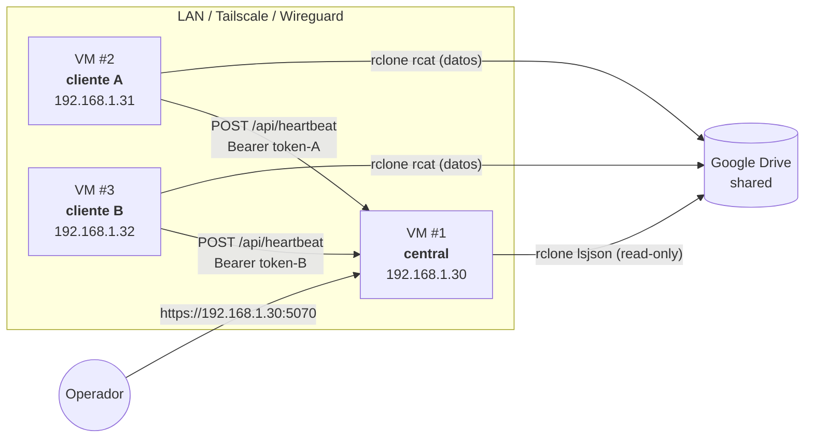

# Deployment — snapshot-V3

## Tabla de modos

| Aspecto | `MODE=client` (default) | `MODE=central` |
|---|---|---|
| Quién se beneficia | Cada servidor que tenés que respaldar | UN host de operaciones que ve a todos los clientes |
| Manda heartbeats | Sí (a `CENTRAL_URL`) | No |
| Recibe heartbeats | No | Sí (`POST /api/heartbeat`) |
| `/dashboard-central` | 404 | Activo |
| Tabla `central_alerts` | Vacía | Se llena con sweep cada 15min |
| Permite gestionar tokens | No | Sí |
| Permite registrar clientes | No | Sí |
| Encola heartbeats si está offline | Sí (`central_queue`) | N/A |

## Topología típica con 2 VMs Ubuntu



Notá: el central NUNCA toca los datos de los clientes; solo recibe
metadatos de los heartbeats. El acceso al shared Drive es opcional —
útil si querés activar `/audit/` (vista agregada que lee directamente
los listados del Drive).

## Instalación de un cliente (un solo servidor)

```bash
# 1. Cloná el repo (o copiá un tarball del release).
git clone https://github.com/lmmenesessupervisa/snapshot-drive.git
cd snapshot-drive

# 2. Instalá el sistema completo (idempotente, requiere sudo).
sudo bash install.sh -y

# 3. Editá el local.conf — credenciales y taxonomía mínimas.
sudo nano /etc/snapshot-v3/snapshot.local.conf

# 4. Bootstrap del primer admin (interactivo).
sudo snapctl admin create --email tu@org --role admin

# 5. Arrancá el backend.
sudo systemctl restart snapshot-backend

# 6. Abrí http://<host>:5070, loguéate, configurá Drive desde la UI.
```

`install.sh` hace todo lo siguiente:

- crea `/etc/snapshot-v3/`, `/var/lib/snapshot-v3/`, `/var/log/snapshot-v3/`
- copia el repo a `/opt/snapshot-V3/` (con `rsync --delete` que NO toca `/etc`)
- crea el venv Python en `/opt/snapshot-V3/.venv` con versiones pinneadas
- instala los binarios del bundle (`rclone`, `restic`, `age`, `age-keygen`)
- registra y arranca:
  - `snapshot-backend.service` (gunicorn)
  - `snapshot-healthcheck.timer` (cada 15 min)
  - `snapshot@archive.timer` (mensual)
  - `snapshot@reconcile.timer` (semanal)
  - `snapshot@db-archive.timer` (diario, condicional a `DB_BACKUP_TARGETS`)

## Instalación de un central

```bash
sudo bash install.sh -y --central
```

Esto agrega:

- Setea `MODE=central` en `local.conf`
- Crea las tablas `central_*` en SQLite
- Bootstrappea el primer admin
- Habilita el sweep de alertas en el healthcheck

Tras instalar:

1. Loguéate al panel: `http://<central-ip>:5070`
2. Andá a `/dashboard-central/clients` → "Nuevo cliente"
3. Por cada cliente que vas a recibir, emití un token desde
   `/dashboard-central/clients/<cid>/tokens` → "Emitir token"
4. **Copiá el token** que se muestra UNA vez. Configurá el cliente desde su propio panel:
   - Browser → `http://<cliente-ip>:5070/settings → Vinculación con servidor central`.
   - Pegá URL del central + token. Marcá "Permitir HTTP en red local" si aplica.
   - Click "Probar conexión" → debe ser chip emerald.
   - Click "Guardar".
5. Forzá un heartbeat real (cualquier backup lo manda):
   ```bash
   sudo snapctl db-archive   # o snapctl archive
   ```
6. En el central, verificá:
   ```bash
   sudo sqlite3 /var/lib/snapshot-v3/snapshot.db \
     "SELECT datetime(received_at), op, status FROM central_events ORDER BY id DESC LIMIT 5;"
   ```

## Probarlo localmente con VMs Ubuntu (sin dominio)

Tenés 2-3 VMs Ubuntu en la misma red. Sirve LAN directa o
Tailscale/Wireguard si están en redes distintas. **No necesitás dominio
ni hosting**. Todo el tráfico va por IP + puerto 5070.

### Setup rápido

| VM | IP | Rol |
|---|---|---|
| VM1 | 192.168.1.30 | central |
| VM2 | 192.168.1.31 | cliente A |
| VM3 | 192.168.1.32 | cliente B |

#### En VM1 (central)

```bash
git clone https://github.com/lmmenesessupervisa/snapshot-drive.git
cd snapshot-drive
sudo bash install.sh -y --central
sudo snapctl admin create --email ops@local --role admin
# Anotá la password temporal que devuelve.

# Verificar que escucha:
ss -ltnp | grep 5070
# Default bind: 127.0.0.1:5070 — para LAN cambiá API_HOST en local.conf:
sudo sed -i 's/^API_HOST=.*/API_HOST="0.0.0.0"/' /etc/snapshot-v3/snapshot.local.conf
sudo systemctl restart snapshot-backend
```

> ⚠ Si exponés `0.0.0.0:5070` directo, hacelo solo en LAN privada.
> Para producción, poné nginx/Caddy delante con TLS (ver más abajo).

Desde tu workstation: abrí `http://192.168.1.30:5070`, loguéate,
registrá el primer cliente desde `/dashboard-central/clients`.

#### En VM2 (cliente A)

```bash
git clone https://github.com/lmmenesessupervisa/snapshot-drive.git
cd snapshot-drive
sudo bash install.sh -y       # SIN --central

sudo snapctl admin create --email admin@vm2 --role admin
sudo systemctl start snapshot-backend
```

Luego desde el browser:

1. `http://192.168.1.31:5070` → login.
2. **Ajustes** → completá `BACKUP_PROYECTO`, `BACKUP_ENTORNO`, `BACKUP_PAIS` → Guardar.
3. **Ajustes → Vinculación con servidor central**:
   - URL: `http://192.168.1.30:5070` + marcar "Permitir HTTP en red local".
   - Token: el de VM1 paso 3.
   - **Probar conexión** → chip emerald.
   - **Guardar**.
4. Forzá un heartbeat real (`sudo snapctl db-archive` o `archive`). En VM1 lo verás en `/dashboard-central/clients/<id>` con un evento nuevo.

Repetí para VM3 con otro cliente y otro token. En VM1 vas a ver los 2
clientes con sus heartbeats.

### Probar el modo offline → drain-queue

```bash
# En VM2, simulá que el central se cae:
sudo iptables -I OUTPUT -d 192.168.1.30 -j DROP

# Disparar archive — fallará el heartbeat, se encolará:
sudo snapctl archive
sudo sqlite3 /var/lib/snapshot-v3/snapshot.db \
  "SELECT id, attempts, state FROM central_queue;"

# Restaurar conectividad:
sudo iptables -D OUTPUT -d 192.168.1.30 -j DROP

# El healthcheck timer (cada 15min) drena la cola. Para acelerar:
sudo snapctl central drain-queue
```

### Probar las alertas

```bash
# En VM1 (central), bajar el threshold para activar rápido:
sudo nano /etc/snapshot-v3/snapshot.local.conf
# ALERTS_NO_HEARTBEAT_HOURS="1"

# Desde la UI (Ajustes → Alertas) o vía:
curl -X POST http://192.168.1.30:5070/api/admin/alerts/config \
  -H "X-CSRF-Token: $(curl -s -b cookie.txt http://.../auth/csrf | jq -r .csrf_token)" \
  -d '{"no_heartbeat_hours":1}'

# Apagá VM2 una hora. Al sweep siguiente:
sudo snapctl central alerts-sweep
# Verás la alerta en /dashboard-central/alerts
```

## TLS / poner detrás de un reverse proxy

El backend bindea HTTP plano. Para producción con dominio real:

```nginx
# /etc/nginx/sites-available/snapshot
server {
    listen 443 ssl http2;
    server_name backups.miorg.com;

    ssl_certificate     /etc/letsencrypt/live/backups.miorg.com/fullchain.pem;
    ssl_certificate_key /etc/letsencrypt/live/backups.miorg.com/privkey.pem;

    location / {
        proxy_pass http://127.0.0.1:5070;
        proxy_set_header Host $host;
        proxy_set_header X-Forwarded-For $proxy_add_x_forwarded_for;
        proxy_set_header X-Forwarded-Proto $scheme;
        proxy_read_timeout 3600;   # archive operations son largas
    }
}
```

Para cliente apuntando a central detrás de nginx:
```bash
CENTRAL_URL="https://backups.miorg.com"   # SIN trailing slash
```

## Upgrade · bajar cambios y aplicarlos

> **Aplica IGUAL en `MODE=client` y `MODE=central`.** El procedimiento es el mismo; lo único que cambia es cuáles blueprints se registran al startup según `MODE` en `snapshot.local.conf` (no requiere intervención manual).

### Modelo del deploy

```
~/snapshot-drive/                       /opt/snapshot-V3/
  └─ git checkout (tu working tree)  →  └─ tree que sirve gunicorn
                                            (rsync --delete fuera de
                                             .venv, bundle, logs)

/etc/snapshot-v3/snapshot.local.conf    /var/lib/snapshot-v3/
  └─ secrets, taxonomía, MODE,             └─ snapshot.db (sqlite WAL)
     CENTRAL_URL/TOKEN, etc.                  rclone.conf
  ↑↑↑ NUNCA se tocan en el upgrade ↑↑↑
```

Resumen: el código vive en `/opt/snapshot-V3/`, pero la config y los datos viven aparte y sobreviven re-deploys. Por eso un upgrade nunca pierde tu vinculación con Drive ni la DB del panel.

### Opción A — Re-install completo (recomendado tras `git pull` con cambios mayores)

Usá esta cuando: cambia `requirements.txt`, se actualiza Python o algún binario del bundle, o simplemente querés el procedimiento canónico.

```bash
# 1. Bajar los cambios
cd ~/snapshot-drive
git pull --ff-only origin main

# 2. Re-instalar (idempotente, ~30-60s sin cambios; minutos si reconstruye venv)
sudo bash install.sh -y

# install.sh hace internamente:
#   - rsync --delete del repo → /opt/snapshot-V3/
#   - re-resuelve requirements.txt en .venv si cambió
#   - re-emplaza unidades systemd y drop-ins
#   - reinicia snapshot-backend.service al final
```

### Opción B — Hot-deploy de cambios chicos (templates, JS, fixes Python)

Usá esta cuando solo cambian archivos bajo `backend/`, `frontend/` o `core/` (mayoría de los commits de iteración rápida). Es ~5-10x más rápido porque no toca el venv ni el bundle.

```bash
# 1. Bajar los cambios
cd ~/snapshot-drive
git pull --ff-only origin main

# 2. Sincronizar al deploy (sin tocar .venv, bundle, logs, /etc, /var/lib)
rsync -a --exclude '__pycache__' backend/ /opt/snapshot-V3/backend/
rsync -a --delete --exclude '.venv' --exclude 'logs/*' \
    --exclude '__pycache__' --exclude 'bundle' \
    frontend/ /opt/snapshot-V3/frontend/
rsync -a core/ /opt/snapshot-V3/core/

# 3. Reiniciar el backend (necesario para que Python recargue módulos)
sudo systemctl restart snapshot-backend.service
```

> **¿Cuándo NO sirve hot-deploy?** Si el commit cambia `requirements.txt` (instala/quita libs Python) o `install.sh` (lógica del instalador). Para esos casos andá a Opción A.

### ¿Qué hace cada `rsync` exactamente?

| Comando | Qué sincroniza | Qué preserva |
|---|---|---|
| `rsync -a backend/ → /opt/.../backend/` | Código Python (Flask, services, central, auth, models) | `.venv/` (excluido), `__pycache__` (excluido) |
| `rsync -a --delete frontend/ → /opt/.../frontend/` | Templates Jinja2, JS, CSS estático | `--delete` borra archivos en destino que ya no están en origen (importante para JS huérfanos) |
| `rsync -a core/ → /opt/.../core/` | Bash CLI (`snapctl`), libs (`*.sh`), `etc/` (config base, NO local.conf) | `/etc/snapshot-v3/` no se toca (vive afuera de `/opt/snapshot-V3/`) |

### Verificar que el upgrade aplicó (mismos checks en cliente y central)

```bash
# 1. Schema migrations corrieron al startup
sudo sqlite3 /var/lib/snapshot-v3/snapshot.db 'PRAGMA user_version;'
# (debe ser igual al CURRENT_VERSION del repo; hoy: 3)

# 2. Servicio activo, sin errores recientes
systemctl is-active snapshot-backend.service
sudo journalctl -u snapshot-backend.service --since "1 minute ago" --no-pager \
    | grep -iE "error|traceback|InterfaceError"
# (vacío = OK)

# 3. Smoke HTTP — debería redirigir a login
curl -s -o /dev/null -w "GET / → %{http_code}\n" http://127.0.0.1:5070/
# (esperado: 302)

# 4. Confirmar MODE efectivo (sanity check del deploy)
sudo /opt/snapshot-V3/.venv/bin/python -c "
import sys; sys.path.insert(0, '/opt/snapshot-V3')
from backend.config import Config
print('MODE:', Config.MODE)
print('CENTRAL_URL:', repr(Config.CENTRAL_URL))
print('CENTRAL_TOKEN set:', bool(Config.CENTRAL_TOKEN))
"
```

### Para que el browser refleje los cambios

Si solo cambió backend (Python/templates) → reload normal alcanza. Si cambió **JS o CSS** → el browser puede tener cacheado el viejo:

- **Chrome / Firefox / Edge**: **Ctrl+Shift+R** (Cmd+Shift+R en Mac) — fuerza hard reload sin caché.
- Si seguís viendo el viejo: DevTools → Network → checkbox "Disable cache" mientras tengas DevTools abierto.
- En último caso: Ctrl+Shift+Delete → solo "Imágenes y archivos en caché" → última hora.

### Despliegue remoto vía SSH (típico cuando central y cliente son máquinas distintas)

Si vos hacés `git pull` desde tu workstation y deployás a un servidor remoto:

```bash
# En tu workstation:
cd ~/snapshot-drive
git pull --ff-only origin main

# Sync remoto a un cliente (o central):
ssh user@host 'cd ~/snapshot-drive && git pull --ff-only && \
  rsync -a --exclude __pycache__ backend/ /opt/snapshot-V3/backend/ && \
  rsync -a --delete --exclude .venv --exclude "logs/*" --exclude __pycache__ --exclude bundle \
    frontend/ /opt/snapshot-V3/frontend/ && \
  rsync -a core/ /opt/snapshot-V3/core/'

# Restart remoto (sudo separado por si requiere password):
ssh user@host 'sudo systemctl restart snapshot-backend.service'
```

### Diferencias específicas por MODO al hacer upgrade

| Aspecto | `MODE=client` | `MODE=central` |
|---|---|---|
| Schema migrations | Corren igual (idempotentes) | Igual |
| Heartbeats en vuelo | Si el cliente estaba mandando, gunicorn los aborta — se reencolan en `central_queue` y el healthcheck los drena después | El receptor está caído ~2s; los clientes reintentan con backoff |
| Sesiones del browser | Sobreviven (cookie + DB persistente) | Igual |
| Vinculación Drive (rclone.conf) | Intacta | Intacta |
| Drive inventory cache | Intacta — `drive_inventory` sigue en DB; el botón "Refrescar" lo reconcilia si hace falta | Igual |
| `/dashboard-central/*` | 404 (correcto, no aplica) | Funciona |
| Timers systemd | `archive`/`db-archive`/`reconcile` siguen — si querés que tomen cambios de su drop-in, `sudo systemctl daemon-reload` (Opción A lo hace) | `healthcheck` con `alerts-sweep` sigue |

### Si algo falla post-upgrade

```bash
# Ver el traceback completo
sudo journalctl -u snapshot-backend.service --since "5 minutes ago" --no-pager | tail -80

# Si /opt/snapshot-V3 quedó corrupto, re-instalá desde cero:
sudo bash uninstall.sh -y     # NO usa --purge → preserva /etc + /var
sudo bash install.sh -y       # bootstrap limpio, datos intactos
```

Las migraciones de SQLite corren al startup (idempotentes, comparan `PRAGMA user_version`). Una migración interrumpida deja el `user_version` en el valor anterior — al re-startear, vuelve a intentarla desde cero.

## Backup del propio sistema

Para no perder la configuración del panel:

```bash
# Periódicamente:
sudo tar -czf snapshot-state-$(date -I).tar.gz \
    /etc/snapshot-v3/ \
    /var/lib/snapshot-v3/snapshot.db \
    /var/lib/snapshot-v3/snapshot.db-wal \
    /var/lib/snapshot-v3/.secret_key \
    /var/lib/snapshot-v3/rclone.conf
```

> Si perdés `.secret_key`/`SECRET_KEY` master, todos los TOTP secrets quedan
> inservibles. Los users tendrán que re-enrolar (con backup codes o `reset-mfa`).

## Diagrama de despliegue completo

```mermaid
flowchart TB
    subgraph WAN["Internet"]
      ACME[Let's Encrypt]
      GD[(Google Drive shared)]
    end
    subgraph DMZ["VPC / LAN privada"]
      Nginx[nginx + TLS]
      Cent[VM Central<br/>MODE=central]
      VM_A[VM Cliente A]
      VM_B[VM Cliente B]
      VM_DB[VM Cliente DB-only<br/>solo db-archive]
    end

    Operator((Operador<br/>Browser)) --> Nginx
    Nginx --> ACME
    Nginx --> Cent

    VM_A -->|heartbeat| Cent
    VM_B -->|heartbeat| Cent
    VM_DB -->|heartbeat| Cent

    VM_A -->|tar &#124; zstd &#124; age &#124; rcat| GD
    VM_B -->|tar &#124; zstd &#124; age &#124; rcat| GD
    VM_DB -->|pg_dump &#124; zstd &#124; age &#124; rcat| GD

    Cent -.->|rclone lsjson, /audit| GD
    Cent --> Mailgun[Email]
    Cent --> Webhook[Slack / Discord]
```


