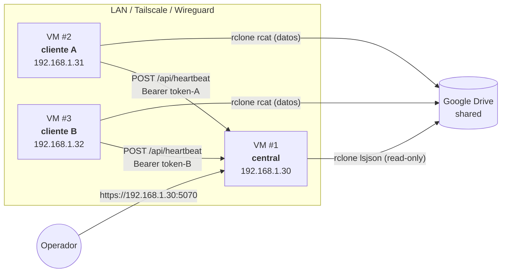

# Deployment — snapshot-V3

## Tabla de modos

| Aspecto | `MODE=client` (default) | `MODE=central` |
|---|---|---|
| Quién se beneficia | Cada servidor que tenés que respaldar | UN host de operaciones que ve a todos los clientes |
| Manda heartbeats | Sí (a `CENTRAL_URL`) | No |
| Recibe heartbeats | No | Sí (`POST /api/heartbeat`) |
| `/dashboard-central` | 404 | Activo |
| Tabla `central_alerts` | Vacía | Se llena con sweep cada 15min |
| Permite gestionar tokens | No | Sí |
| Permite registrar clientes | No | Sí |
| Encola heartbeats si está offline | Sí (`central_queue`) | N/A |

## Topología típica con 2 VMs Ubuntu



Notá: el central NUNCA toca los datos de los clientes; solo recibe
metadatos de los heartbeats. El acceso al shared Drive es opcional —
útil si querés activar `/audit/` (vista agregada que lee directamente
los listados del Drive).

## Instalación de un cliente (un solo servidor)

```bash
# 1. Cloná el repo (o copiá un tarball del release).
git clone https://github.com/lmmenesessupervisa/snapshot-drive.git
cd snapshot-drive

# 2. Instalá el sistema completo (idempotente, requiere sudo).
sudo bash install.sh -y

# 3. Editá el local.conf — credenciales y taxonomía mínimas.
sudo nano /etc/snapshot-v3/snapshot.local.conf

# 4. Bootstrap del primer admin (interactivo).
sudo snapctl admin create --email tu@org --role admin

# 5. Arrancá el backend.
sudo systemctl restart snapshot-backend

# 6. Abrí http://<host>:5070, loguéate, configurá Drive desde la UI.
```

`install.sh` hace todo lo siguiente:

- crea `/etc/snapshot-v3/`, `/var/lib/snapshot-v3/`, `/var/log/snapshot-v3/`
- copia el repo a `/opt/snapshot-V3/` (con `rsync --delete` que NO toca `/etc`)
- crea el venv Python en `/opt/snapshot-V3/.venv` con versiones pinneadas
- instala los binarios del bundle (`rclone`, `restic`, `age`, `age-keygen`)
- registra y arranca:
  - `snapshot-backend.service` (gunicorn)
  - `snapshot-healthcheck.timer` (cada 15 min)
  - `snapshot@archive.timer` (mensual)
  - `snapshot@reconcile.timer` (semanal)
  - `snapshot@db-archive.timer` (diario, condicional a `DB_BACKUP_TARGETS`)

## Instalación de un central

```bash
sudo bash install.sh -y --central
```

Esto agrega:

- Setea `MODE=central` en `local.conf`
- Crea las tablas `central_*` en SQLite
- Bootstrappea el primer admin
- Habilita el sweep de alertas en el healthcheck

Tras instalar:

1. Loguéate al panel: `http://<central-ip>:5070`
2. Andá a `/dashboard-central/clients` → "Nuevo cliente"
3. Por cada cliente que vas a recibir, emití un token desde
   `/dashboard-central/clients/<cid>/tokens` → "Emitir token"
4. **Copiá el token** que se muestra UNA vez. Pegálo en el cliente:
   ```bash
   sudo nano /etc/snapshot-v3/snapshot.local.conf
   # ...
   CENTRAL_URL="https://<central-ip>:5070"
   CENTRAL_TOKEN="snap_xxx..."
   ```
5. En el cliente: `sudo systemctl restart snapshot-backend`
6. Forzá un heartbeat de prueba:
   ```bash
   sudo snapctl central send-test
   ```

## Probarlo localmente con VMs Ubuntu (sin dominio)

Tenés 2-3 VMs Ubuntu en la misma red. Sirve LAN directa o
Tailscale/Wireguard si están en redes distintas. **No necesitás dominio
ni hosting**. Todo el tráfico va por IP + puerto 5070.

### Setup rápido

| VM | IP | Rol |
|---|---|---|
| VM1 | 192.168.1.30 | central |
| VM2 | 192.168.1.31 | cliente A |
| VM3 | 192.168.1.32 | cliente B |

#### En VM1 (central)

```bash
git clone https://github.com/lmmenesessupervisa/snapshot-drive.git
cd snapshot-drive
sudo bash install.sh -y --central
sudo snapctl admin create --email ops@local --role admin
# Anotá la password temporal que devuelve.

# Verificar que escucha:
ss -ltnp | grep 5070
# Default bind: 127.0.0.1:5070 — para LAN cambiá API_HOST en local.conf:
sudo sed -i 's/^API_HOST=.*/API_HOST="0.0.0.0"/' /etc/snapshot-v3/snapshot.local.conf
sudo systemctl restart snapshot-backend
```

> ⚠ Si exponés `0.0.0.0:5070` directo, hacelo solo en LAN privada.
> Para producción, poné nginx/Caddy delante con TLS (ver más abajo).

Desde tu workstation: abrí `http://192.168.1.30:5070`, loguéate,
registrá el primer cliente desde `/dashboard-central/clients`.

#### En VM2 (cliente A)

```bash
git clone https://github.com/lmmenesessupervisa/snapshot-drive.git
cd snapshot-drive
sudo bash install.sh -y       # SIN --central

sudo nano /etc/snapshot-v3/snapshot.local.conf
# Setea:
#   CENTRAL_URL="http://192.168.1.30:5070"
#   CENTRAL_TOKEN="<el token que emitiste en VM1>"
#   BACKUP_PROYECTO="superaccess-uno"
#   BACKUP_ENTORNO="local"
#   BACKUP_PAIS="colombia"

sudo snapctl admin create --email admin@vm2 --role admin
sudo systemctl restart snapshot-backend

# Forzar un heartbeat manual:
sudo snapctl central send-test
# Esperado: 200 OK del central. En VM1 vas a verlo en /dashboard-central.
```

Repetí para VM3 con otro cliente y otro token. En VM1 vas a ver los 2
clientes con sus heartbeats.

### Probar el modo offline → drain-queue

```bash
# En VM2, simulá que el central se cae:
sudo iptables -I OUTPUT -d 192.168.1.30 -j DROP

# Disparar archive — fallará el heartbeat, se encolará:
sudo snapctl archive
sudo sqlite3 /var/lib/snapshot-v3/snapshot.db \
  "SELECT id, attempts, state FROM central_queue;"

# Restaurar conectividad:
sudo iptables -D OUTPUT -d 192.168.1.30 -j DROP

# El healthcheck timer (cada 15min) drena la cola. Para acelerar:
sudo snapctl central drain-queue
```

### Probar las alertas

```bash
# En VM1 (central), bajar el threshold para activar rápido:
sudo nano /etc/snapshot-v3/snapshot.local.conf
# ALERTS_NO_HEARTBEAT_HOURS="1"

# Desde la UI (Ajustes → Alertas) o vía:
curl -X POST http://192.168.1.30:5070/api/admin/alerts/config \
  -H "X-CSRF-Token: $(curl -s -b cookie.txt http://.../auth/csrf | jq -r .csrf_token)" \
  -d '{"no_heartbeat_hours":1}'

# Apagá VM2 una hora. Al sweep siguiente:
sudo snapctl central alerts-sweep
# Verás la alerta en /dashboard-central/alerts
```

## TLS / poner detrás de un reverse proxy

El backend bindea HTTP plano. Para producción con dominio real:

```nginx
# /etc/nginx/sites-available/snapshot
server {
    listen 443 ssl http2;
    server_name backups.miorg.com;

    ssl_certificate     /etc/letsencrypt/live/backups.miorg.com/fullchain.pem;
    ssl_certificate_key /etc/letsencrypt/live/backups.miorg.com/privkey.pem;

    location / {
        proxy_pass http://127.0.0.1:5070;
        proxy_set_header Host $host;
        proxy_set_header X-Forwarded-For $proxy_add_x_forwarded_for;
        proxy_set_header X-Forwarded-Proto $scheme;
        proxy_read_timeout 3600;   # archive operations son largas
    }
}
```

Para cliente apuntando a central detrás de nginx:
```bash
CENTRAL_URL="https://backups.miorg.com"   # SIN trailing slash
```

## Upgrade

```bash
cd /path/to/snapshot-drive
git pull origin main
sudo bash install.sh -y
# install.sh hace rsync --delete a /opt/snapshot-V3 — preserva
# /etc/snapshot-v3 y /var/lib/snapshot-v3.
```

Tras el upgrade el backend se reinicia solo. Las migraciones de SQLite
corren al startup (idempotentes, comparan `PRAGMA user_version`).

## Backup del propio sistema

Para no perder la configuración del panel:

```bash
# Periódicamente:
sudo tar -czf snapshot-state-$(date -I).tar.gz \
    /etc/snapshot-v3/ \
    /var/lib/snapshot-v3/snapshot.db \
    /var/lib/snapshot-v3/snapshot.db-wal \
    /var/lib/snapshot-v3/.secret_key \
    /var/lib/snapshot-v3/rclone.conf
```

> Si perdés `.secret_key`/`SECRET_KEY` master, todos los TOTP secrets quedan
> inservibles. Los users tendrán que re-enrolar (con backup codes o `reset-mfa`).

## Diagrama de despliegue completo

```mermaid
flowchart TB
    subgraph WAN["Internet"]
      ACME[Let's Encrypt]
      GD[(Google Drive shared)]
    end
    subgraph DMZ["VPC / LAN privada"]
      Nginx[nginx + TLS]
      Cent[VM Central<br/>MODE=central]
      VM_A[VM Cliente A]
      VM_B[VM Cliente B]
      VM_DB[VM Cliente DB-only<br/>solo db-archive]
    end

    Operator((Operador<br/>Browser)) --> Nginx
    Nginx --> ACME
    Nginx --> Cent

    VM_A -->|heartbeat| Cent
    VM_B -->|heartbeat| Cent
    VM_DB -->|heartbeat| Cent

    VM_A -->|tar &#124; zstd &#124; age &#124; rcat| GD
    VM_B -->|tar &#124; zstd &#124; age &#124; rcat| GD
    VM_DB -->|pg_dump &#124; zstd &#124; age &#124; rcat| GD

    Cent -.->|rclone lsjson, /audit| GD
    Cent --> Mailgun[Email]
    Cent --> Webhook[Slack / Discord]
```


